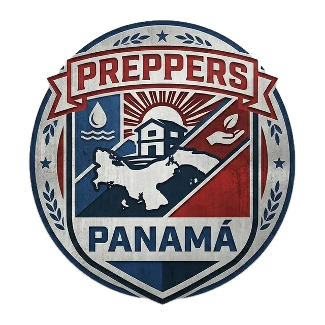

<div align="center">
  
  <h1>Preppers Panamá</h1>
  <p>Fomentando la resiliencia y la preparación en la República de Panamá. Tecnología, equipo y conocimiento para lo inesperado.</p>
</div>

## Requisitos

- [Bun](https://bun.sh) >= 1.2

## Desarrollo

```bash
bun install
bun dev
```

## Producción

```bash
bun run build
bun start
```

## Tecnologías

- **Framework:** Next.js 16 (App Router)
- **Lenguaje:** TypeScript
- **Estilos:** Tailwind CSS v4
- **Runtime:** Bun
